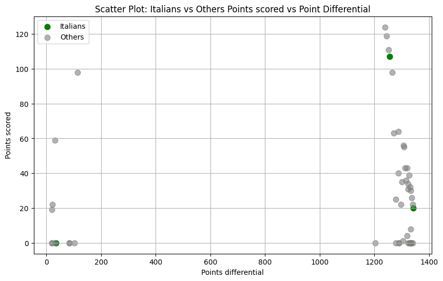
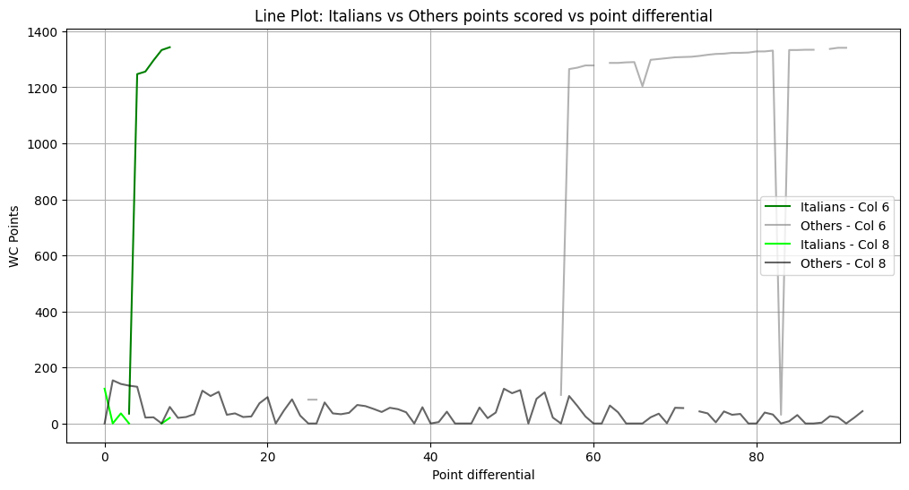

# Advantages in Performance from Hosting the Olympics

**Contributors:**  
Rama Rao Vencharla, Nicholas Roder

## Summary
This project aims to analyze if the Olympic Games exhibit any real competitive preference for or towards the host nation. The Olympics are known nationally and internationally as one of the most reputable athletic organisations and they believe in fairness, equity and equal playing field. Host nations can also offer a competitive advantage though due to the comfort of home cities, home audiences, travel less, and increased investment that countries have made in athletics. The objective of this project was to examine whether a competitive advantage could be observed on the Olympic performance data available, with special reference to Italy being the host country for the Milano Cortina Olympic Games. 

The main research questions for analysis were: 
- In comparison to athletes of other countries, are Italian athletes better performing? 
- What is the average score for Italian athletes in different sections of games? 
- What is the average rank for Italian competitors compared to the rest of the field? 

These questions were designed to test whether any statistically meaningful differences could be made between the host country and nations involved in this project. The data for this project were scraped from the official Olympic website -- specifically from medals-by-sport section on the Olympic Games Milano Cortina 2026 Medals by Sport web page. For the most part, the original data in the form of an easily analyzable format was hard to find. Therefore, the webpages were converted into PDF documents, processed by OCR (Optical Character Recognition) models to extract tabular information and transform it into data that can be processed in the computer's own format. Since many of the PDF pages lack structured competition tables, a logistic regression machine learning model was developed. The data was then classed based on whether PDF documents were tabular in nature and processed. This minimized unwanted OCR processing and enhanced workflow speed. The data were subsequently preprocessed and cleaned extensively after extraction. Since OCR artifacts to severe depth, different sports had different table shapes and formatting corruption, substantial manual correction was needed. The data compiled in all sports was consolidated into a unified extracted-tables.csv dataset to ease transportation and to facilitate downstream analysis. The Italian athletes performance was also analyzed by means of exploratory data and statistical comparison by comparing the figures to the athletes of the other countries, namely the mean and the rank and the competition related statistics. 

The final results did not suggest that Italian competitors were better than the other countries at these Olympic events. In truth, the average point totals of Italian participants were below the average for all other selected countries. Although there were localized differences between the individual sports, no consistent pattern of systematic host-country performance inflation emerged. Nevertheless, there are challenges to data quality and the limited scope of examination of only one Olympic event restrict generalisation of longer-term Olympic host-country trends.

### Scripts
#### `scrape_olympic_hosts.py`

The `scrape_olympic_hosts.py` script is designed to automate the extraction and refinement of historical and future Olympic Games host data from Wikipedia. The script utilizes the `requests` library with a customized User-Agent to bypass automated access restrictions and employs `pandas` for robust HTML table parsing. The primary functionalities include:

- **Automated Data Retrieval:** Fetches the most recent version of the "List of Olympic Games host cities" directly from Wikipedia's live servers.
- **Structural Error Correction:** Implements a backfill (`bfill`) strategy to resolve `NaN` values and data misalignment caused by Wikipedia’s complex table layouts, such as merged cells and hidden "icon" columns.
- **Standardized Text Normalization:**
    - Aggressively removes Wikipedia-specific metadata, such as citation brackets (e.g., `[a]`, `[11]`) and footnotes.
- **Dynamic Status Classification:** Automatically categorizes each Games record based on the current date (May 2026). The script assigns one of four specific tags: `complete` (historical games), `future` (upcoming events), `cancelled` (war-impacted games), or `postponed` (e.g., Tokyo 2020).
- **Data Validation & Export:** Filters out non-games metadata rows and ensures chronological integrity before exporting the final dataset as `olympic_hosts_clean.csv` for downstream analysis.

## Data Profile

### 1. Milano Cortina 2026 Event Results

The datasets utilized in this work were extracted from the official medal-by-sport data of the Olympics Milano Cortina 2026 Medals by Sport. These webpages included athlete standings, rankings, scores, competition information for a wide variety of sports and divisions belonging to Milano Cortina Olympic Games. Since the Olympic website did not provide the data directly as downloadable data in structured format for analysis, the data collection process took a number of stages: webpage scraping, PDF conversion, OCR extraction and manual restructuring. This project repository was mainly based on an aggregate dataset, referred to as extracted-tables.csv, located inside the repository data directory process. This file held the combined outcomes of all OCR-extracted Olympic competition tables across the sports examined in the project. Packaging all of the extracting sports data into a single file made organization of transport and their projects easier, although a significant burden in formatting and preprocessing. Because each Olympic sport had its unique table structure, headers, scoring system, and layout, the composite dataset did not have a standardized schema at the time of extraction. In addition to extracted-tables.csv, the repository also included the original PDF files sourced from the webpages of the Olympics. The PDFs were stored in the raw data directory and used as parent documents for OCR extraction. From each PDF, we had one or more of the competition tables available on the Olympic website. The repository also had intermediate extraction outputs and a history.json file created using OpenRefine. This file remained a repeatable record of the considerable manual cleaning and restructuring done across preprocessing. 

The structure of `extracted-tables.csv` exemplified the difficulties involved in importing heterogeneous Olympic contest tables in a single normalized schema. Most of the columns were numeric since different sports and event types had different scoring significance. Some important columns were, however, consistent throughout the dataset. The NOC column represents the country of the athlete (the standard three-letter Olympic country). The Rank column showed the overall position of the athlete in the competition. Athlete identity was indicated with first- and last-name fields. The source_pdf column revealed which PDF document produced the row, whereas the page column indicated the specific PDF page used for extraction. The sport column is an athlete and a gender-division column for each row. Other columns had event-specific score, temporal scores or result-based based upon the sport section. The dataset attributes posed considerable challenges, in order to ensure reliability and consistency. OCR artifacting led to rampant corruptions, broken columns, missing fields, and malformed numeric entries. In many instances, tables included caveats or explanatory text within the radius of table borders which the OCR system would misread as the actual data rows. Over a hundred fragmented columns, which only were meaningful columns for the relatively few variables, were generated in the first extraction process. This high level of structural inconsistency made automated parsing insufficient. The datasets were cleaned and organized manually using OpenRefine to create a general schema for exploratory analysis. Limited temporal and geographic scope was also an important facet of the dataset. The project focused on only one Olympic event — which prevented longitudinal trends toward host country performance from being identified with relative certainty. Similarly, a small number of athletes participated competitively under host-country conditions, limiting making generalizations about these geographic competitive advantages. Therefore, the project served more as an exploratory study than a conclusive statistical analysis. 

Ethically and legally, the datasets used for this project were freely available through the official Olympic website, and were unmonitored. No personal or private information was collected within the analysis. Every single one of the data points was all based on publicly published athletic competition results accessible by every user. However, this project still needed some care in processing to avoid the transcription error problem of OCR extraction, and distort the original records accidentally. As a result, preserving traceability in all data flows, it was crucial to keep it traceable via the source_pdf and page columns, that is, to ensure transparency, ensuring that we could perform manual verification against the parent documents. The datasets directly addressed the research questions regarding potential host-country performance advantages. Ranking, scoring and nationality data found in the tables made the tables suitable for making comparisons between Italian athletes and those of the other countries’ athletes with respect to other countries. While more historical Olympic data at least would strengthen the analysis significantly, the information that we had was a useful first step when trying to see if host countries showed measurable differences in performance. Had that same extraction and cleaning procedure been employed across multiple Olympic years, the same database organization could facilitate wider longitudinal analysis which can reveal long-term trends in Olympic host-country performance.

#### License & Access

- **License**: Creative Commons Attribution 4.0 (CC BY 4.0)
- **Update Frequency**: Monthly
- **Access Method**: Downloadable CSV files 

#### Permitted Uses
- Access, copy, analyze, modify, and distribute the data
- Incorporate the data into products or services
- Use the data for any lawful, non-commercial purpose, including academic research and public reports

#### Prohibited Uses
- Using the data without acknowledging the contributors or the International Olympic Committee.
- Using the data or associated Olympic marks in a way that suggests an official endorsement or sponsorship by the IOC where none exists.
- You may not apply legal terms or technological measures that legally restrict others from doing anything the license permits.

### 2. Olympic Host Cities (1896-2034)
The second dataset provides a comprehensive historical and forward-looking record of the host cities for the modern Olympic Games (1896–2034). This dataset enables an analysis of the geographic distribution and seasonal frequency of the Games, as well as the impact of geopolitical events on their execution.

#### Structure & Contents
The dataset, derived from the official Olympic records and verified via Wikipedia’s historical archives, includes the following fields:
- `year`: the calendar year in which the Games were held or are scheduled to be held (YYYY).

- `city`: the specific municipality designated as the host (e.g., Paris, Tokyo)

- `country`: the sovereign state where the host city is located

- `season`: the classification of the Games as either summer or winter

- `status`: the operational outcome of the Games, categorized into four specific types:

    - `complete`: Games that have successfully concluded (including Milan-Cortina 2026).

    - `future`: Games officially awarded by the IOC that have not yet occurred (Summer 2026 onwards).

    - `cancelled`: Games that were scheduled but aborted (primarily due to WWI and WWII).

    - `postponed`: Games that were delayed to a later date

#### Data Handling

- Data was scraped from the "List of Olympic Games host cities" via Wikipedia using `pandas`, `requests`, and `StringIO`.

- A backfill (`bfill`) strategy was implemented to resolve NaN values caused by Wikipedia's "spacer" columns and merged cell layouts.

- String normalization was applied to ensure `city`, `country`,`season`, and `status` fields are standardized to facilitate uniform data joins with other global datasets.

- The raw HTML was processed into a structured CSV format (`olympic_hosts_clean.csv`) and stored in `data/`.

#### License & Access

- **License**: Creative Commons Attribution 4.0 (CC BY 4.0)
- **Update Frequency**: Monthly
- **Access Method**: Open access via Wikimedia Foundation and International Olympic Committee (IOC) archives

Wikipedia content is generally licensed under the CC BY-SA 4.0, which allows for the redistribution and adaptation of data provided that appropriate credit is given and the resulting work is distributed under the same license.

#### Permitted Uses
- Access, copy, analyze, modify, and redistribute the data freely
- Incorporate the data into academic research, reports, software, and publications
- Use the data for both commercial and non-commercial purposes
- If you remix, transform, or build upon the material, you must distribute your contributions under the same license as the original.

#### Prohibited Uses
- Using the data without acknowledging the contributors or the International Olympic Committee.
- Using the data or associated Olympic marks in a way that suggests an official endorsement or sponsorship by the IOC where none exists.
- You may not apply legal terms or technological measures that legally restrict others from doing anything the license permits.

### Data Integration & Compatibility

The two datasets are integrated using a composite key of **`year`**, **`season`**, and ****`country/noc`**. This alignment allows for a direct mapping of athlete-level performance results to the specific environmental and host-country context of each Olympic Games.

#### Integration Logic
- **Temporal Alignment**: Performance data is joined with the host dataset on the `year` and `season` identifiers.
- **Geographic Correspondence**: By matching the athlete's `country/noc` with the `country` field in the host dataset, the pipeline dynamically flags "Host Nation" status for specific records.
- **Technical Pipeline**: All preprocessing, string normalization, and joining are handled within **Python** using **Pandas**. The workflow ensures the transformation from raw Wikipedia and IOC scrapes to the final merged analytical set is reproducible.

#### Provenance & Ethics
To maintain high scientific integrity and ensure reproducibility:
- **Official Sources Only**: We intentionally prioritize datasets from official Olympic sources or reputable archival databases.
- **Kaggle Exclusion**: We strictly avoid using datasets from Kaggle or similar community-uploaded platforms due to concerns regarding licensing transparency, data provenance, and the potential for "black box" preprocessing.

### Validation

To ensure the integrity of the integrated dataset, the following validation steps are performed automatically within the pipeline:

- **Schema Consistency**: Field types are confirmed and corrected; specifically, `year` is cast to integer types and text fields are validated for case-sensitivity (e.g., lowercase `city` and uppercase `country`).
- **Null & Artifact Detection**: Both datasets are scanned for `NaN` values resulting from OCR artifacts or Wikipedia table "spacers." Rows failing primary key validation are dropped.
- **Hash-based Integrity**: SHA-256 hash-based integrity checks are applied to the `raw_data/` and `processed_data/` files to detect any unintended modifications during the automation process.
- **Reference Verification**: The total number of Games identified in the final merged set is cross-referenced against official IOC counts to ensure no historical records were lost during the scraping or joining process.


## Findings

This project investigated whether Italian athletes, as representatives of the host nation, experienced a significant performance advantage during the Milano Cortina 2026 Olympic Games. Through exploratory analysis of athlete rankings and competition scores, the study sought to quantify potential host-country bias. The findings revealed no robust evidence of performance inflation; in fact, the average Italian scoring performance trailed slightly behind the international average. Rank distribution plots further confirmed that Italian competitors were distributed across the standings rather than clustered at the top. While individual successes occurred, they were not consistent enough across sports to suggest a systemic comparative advantage for the host nation.

The analysis highlighted significant technical challenges inherent in processing Olympic data via OCR (Optical Character Recognition) pipelines. Many statistical summaries were initially compromised by missing or corrupted values caused by complex source formatting and OCR artifacts. While extensive cleaning in OpenRefine improved data usability, residual errors remained in the final numerical outputs, requiring manual intervention to correct unrealistic results. Furthermore, the lack of standardization across different sports—which utilize varying scoring systems, elimination brackets, and time-based measurements—made direct global comparisons difficult. Consequently, the research focused primarily on relative rankings and within-sport comparisons.

Despite these data quality hurdles, the project successfully demonstrated that large-scale Olympic datasets can be reconstructed using machine learning-assisted preprocessing. A logistic regression classifier was particularly effective in identifying tabular PDF pages, significantly improving workflow efficiency by filtering out non-essential content before OCR. This manual schema reconstruction provides a foundational framework for future longitudinal Olympic research. By documenting cleaning operations in `history.json` files, the study established a reproducible methodology that can serve as a baseline for future automation and as a teaching tool for scalable data initiatives.

Future iterations of this research should focus on automating schema recognition to eliminate manual labor and enhance scalability. Moving beyond exploratory statistics, the application of regression modeling, Bayesian methods, and hypothesis testing could better quantify host-country effects. Integrating contextual metadata—such as athlete biographies, previous world rankings, and national funding levels—would further allow researchers to isolate hosting factors from other variables. Ultimately, developing a reusable, automated Olympic database would enable dynamic analytics and predictive modeling, offering deeper insights into competitive balance and performance trends at global sporting events.

#### Visualizations


Figure 1: Scatterplot comparing Italian and non‑Italian athlete performance in Alpine Skiing (C26). This figure displays the relationship between points differential (x‑axis) and points scored (y‑axis) for Italian athletes (green) and all other competitors (gray). The plot illustrates that Italian athletes cluster at higher point‑differential values, indicating stronger overall performance relative to the broader field. 


Figure 2: Line plot of points scored and point differential for Italian and non‑Italian athletes in Alpine Skiing (C26). This figure shows trends in World Cup points (y‑axis) across athlete index values (x‑axis), comparing Italians (green and light green) with non‑Italian competitors (gray and black). The Italian group demonstrates consistently higher point‑differential values, highlighting performance differences across the dataset. 

### Challenges

The most pressing problem the project had to face was the dreadful quality of the OCR outputted data. While human-readable visual representations of the Olympic source materials were present, converting the PDF tables to usable tables was extremely challenging. OCR artifacting was evident in almost all parts of the extracted data as well as in a number of cases for systematic degradation, fragmentation and formatting discrepancy. Values were frequently not completely recognized, merged and not detected at all. It is believed that some fifteen percent of the original raw data was improperly formatted into tabular format, which severely impacted confidence in parts of the raw data. The lack of structural consistency of the Olympic sports tables represented another great challenge. 

Both sports used different formats as they have different schemas, scoring systems or formatting styles. Certain tables had merged cells, multi-line headers, or arbitrary spacing that resulted in extremely fractured columns when OCR was drawn. Due to the above, the resulting datasets couldn’t effectively be parsed through completely automated approaches. Much of the cleaning had to be done manually within OpenRefine to construct a generalized schema that could facilitate further analysis. All sports were aggregated into one extracted-tables.csv file helped in transportation and organization of data but it also made restructuring to be a lot harder as each sport had different data representation. Meta rows caused substantial problems during preprocessing. Many in-text PDF tables had caveats, explanatory notes, or formatting text placed at the edges of the competition tables. OCR models often incorrectly considered these notes to be real athletes' information, leading to higher numbers of missing records and abnormal columns being included in the collected datasets. These rows needed to be identified and then removed manually to avoid contamination of this analysis. Prior to cleaning, some extracted tables had well over one hundred columns of data, even though they only contained a fraction of the real information. The issues with data typing made the workflow even more complex. OCR errors or inconsistent formatting led to erroneous storage of numbers as strings. 

In other ways, decimal points were in place or removed out of place, contributing to unrealistic values and statistics and impossible numbers. And in some, multiple columns were inadvertently combined into very large numbers. Given that the values could not be trusted except through verification, these problems significantly slowed exploratory analysis. Before it is possible to carry out any numerical analyses, the whole process involved significantly time being spent on converting corrupted fields to usable numeric formats. Lack of data also posed a major obstacle. While table shapes were different in the concatenated data set, missing values were often displayed in different columns as a function of sport or extraction mode. While some imputation was made, the majority of missing-value handling was left to manual correction, as automated methods were liable to introduce more errors. The OpenRefine history.json file was especially useful since it recorded a repeatable history of many manual cleaning operations performed over the duration of this project. From an analytical view the restricted scope of the dataset brought additional aspects of difficulty. The one Olympic event which we analyzed was only one, so that reliable chronological trends and convincing statistical conclusions on host country performance were not possible. At the same time, only a small number of athletes competed under host-country conditions in the dataset, which makes it difficult to confidently separate those benefits from geographic ones or environmental forces. Nevertheless, the project provided important experience in handling extremely unstructured real-world datasets. These challenges showed the necessity of good preprocessing pipelines, careful manual confirmation and cautiously interpreting imperfect data. Even more importantly, this project also showed that often data cleansing and validation become the main elements of actual data science workflow, especially with OCR-derived insights and disparate format from source material.

### Lessons Learned + Future Work

One of the biggest things that we discovered during this project is the importance of quality data to be able to perform successful downstream analysis. It was much more time spent at cleaning, restructuring and validating the datasets than it was originally anticipated. The OCR extraction pipeline was capable to record some amount of information to the Olympic PDF files, but manual processing was necessary to accomplish that. This underscored the importance of a robust preprocessing workflow in early project phases in particular, when working with semi-structured or OCR-based datasets. Big potential for future contributions would be to extend the dataset to more than one Olympic event. This means that to derive long-term trends for host-country performance, only one set of Olympic competitions was analyzed in the current project. 

For example, future research might use similar extraction and cleaning techniques in historical Olympic Games data sets to assess performance of host-country comparisons over different generations. By doing so, more definitive statistical statements about how good host countries are historically would be drawn, as well as the degree to which they beat such expectations over time. OCR and extraction pipeline optimization can also be a focus of future work. Although the OCR models were able to retrieve a big part of tabular data, about fifteen percent of the data is corrupt, fragmented and missing values. More sophisticated OCR models, table-recognition systems, computer vision techniques might have a meaningful effect on extraction accuracy. Further preprocessing techniques, such as image enhancement, adaptive thresholding, or PDF segmentation, may reduce artifacting before OCR occurs. Automating more of the schema reconstruction process would be another notable improvement. Most of this cleaning procedure was manual in OpenRefine, because each sport used different structures and conventions of table layout. Creating rule-based parsers or machine-learning systems that use algorithms to classify the layout of tables automatically would massively cut down on human effort and give the project a large amount of scalability. The history.json file generated in response to OpenRefine processing already can be a reproducible record of manual cleaning work performed and may serve as a training target for automation in the future. Further statistical analyses and machine learning approaches could add to the analytical part of the project. 

Analysis was mainly exploratory statistics and summary comparison. Further work is needed to do such things as regression analyses, hypothesis checking, clustering or Bayes methods to make more precise the impact of host country. Other external factors, like athlete history, Olympic history, travel distance, audience size and funding levels at the federal level, could also be included in models. Another shortcoming of existing dataset is the lack of contextual metadata. Future studies might include more external data sources, such as athlete profiles, world level rankings, Olympic outcomes or qualification analysis. Integrating these data sets would give the analysis a more vibrant climate, as well as allow the isolation of host-country effects from other factors that may contribute. 

Finally, this work showed that we could obtain a new Olympic data infrastructure from third party sources. With enough automation it may be possible to establish an Olympic database that is always updated and is able to be a part of real-time or dashboard or predictive modeling applications. This system (if developed) may result in fuller examinations of fairness, balance, and trends in performance throughout international sporting events.

## Reproducing

### 1. Clone the Repository (Terminal)
```bash
git clone https://github.com/NCRoder/IS477_project
cd IS477_project
```
You can open the project in Visual Studio Code with this command:
```bash
code .
```

### 2. Activate Virtual Environment (Terminal)

**(If existing base or Venv)**  
Remove Conda Base Environment:
```bash
conda deactivate
```

Remove Existing Virtual Environment:
```bash
exec zsh
```

**On Windows (PowerShell or Command Prompt):**
```bash
python -m venv venv
Set-ExecutionPolicy RemoteSigned -Scope CurrentUser #(Run Once)
venv\Scripts\activate
```

**On macOS / Linux (Terminal):**
```bash
python -m venv venv
source venv/bin/activate
```

### 3. Install Dependencies (Terminal)

Use the terminal to install all required packages:

**On macOS / Linux (Terminal):**
```bash
python3 -m pip install -r requirements.txt
```
**On Windows (PowerShell or Command Prompt):**
```bash
python -m pip install -r requirements.txt
```

### Gather Olympic hosts dataset (Terminal)
**On macOS / Linux (Terminal):**
```bash
python3 scripts/scrape_olympic_hosts.py
```
**On Windows (PowerShell or Command Prompt):**
```bash
python scripts/scrape_olympic_hosts.py
```

If you run into issues during the data merging step (e.g., missing or corrupted files), you can download a preprocessed version of the combined dataset:

📁 **Instructions:**  

### 4. Run the Workflow (Terminal)


### 6. View Results

Visualizations will be stored in the `visualization/` directory.

## Citations

- **Olympic Hosts:**  
List of Olympic Games host cities: Wikipedia contributors. (2026). List of Olympic Games host cities. Wikipedia, The Free Encyclopedia. https://en.wikipedia.org/wiki/List_of_Olympic_Games_host_cities

- **Olympic Winter Milano Cortina 2026 Results:**  
Olympic Winter Games Milano Cortina 2026 (General Reports): International Olympic Committee. (2026). Olympic Winter Games Milano Cortina 2026: General Reports. https://www.olympics.com/en/milano-cortina-2026/results/general-reports

### Software

- **Python (Programming Language):**  
  Python Software Foundation. (2023). *Python (Version 3.x) [Computer software].* https://www.python.org

- **pandas (Data manipulation and analysis):**  
  The pandas development team. (2023). *pandas (Version X.X) [Computer software].* https://pandas.pydata.org

- **NumPy (Numerical computing):**  
  Harris, C. R., Millman, K. J., van der Walt, S. J., Gommers, R., Virtanen, P., Cournapeau, D., ... & Oliphant, T. E. (2020). Array programming with NumPy. *Nature, 585(7825),* 357–362. https://doi.org/10.1038/s41586-020-2649-2

- **Matplotlib (Data visualization):**  
  Hunter, J. D. (2007). Matplotlib: A 2D graphics environment. *Computing in Science & Engineering, 9(3),* 90–95. https://doi.org/10.1109/MCSE.2007.55i

- **Snakemake (Workflow automation):**  
  Mölder, F., Jablonski, K. P., Letcher, B., Hall, M. B., Tomkins-Tinch, C. H., Sochat, V., ... & Grüning, B. A. (2021). Sustainable data analysis with Snakemake. *F1000Research, 10,* 33. https://doi.org/10.12688/f1000research.29032.2

- **YData Profiling (Data Analysis Tool):**  
ydata-profiling (Data profiling and EDA): YData. (2024). ydata-profiling (Version X.X) [Computer software]. https://github.com/ydataai/ydata-profiling